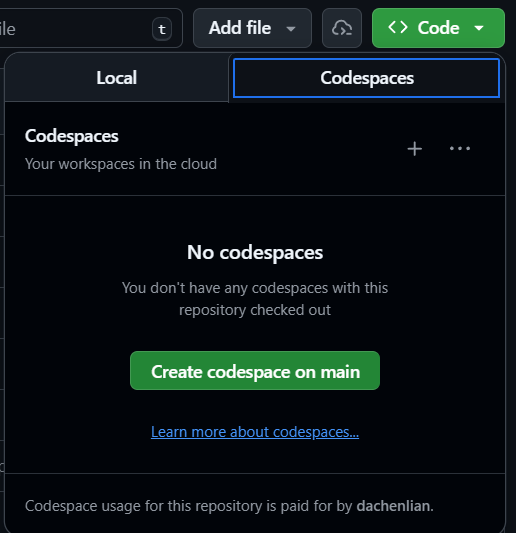

# MCP Demo

A demonstration repository showcasing the **Model Context Protocol (MCP)**.

## Overview

This repository contains:

- **Custom MCP Server** (`server.py`): A linguistic analysis server built with FastMCP that provides:
  - Corpus resources for text retrieval
  - Linguistic analysis tools (TTR calculation, word counting, etc.)
  - Pre-built prompts for common analysis workflows

- **Jupyter Notebooks** (`notebooks/`):
  - `mcp_short.ipynb`: Comprehensive introduction to MCP concepts, architecture, and design principles
  - `mcp_long.ipynb`: Extended tutorial with additional examples

- **Demo Walkthrough** (`DEMO_WALKTHROUGH.md`): Step-by-step guide for classroom demonstration showing how to use VS Code to:
  - Use our newly created linguistic analysis MCP server
  - Search and download academic papers from arXiv
  - Perform AI-assisted research analysis

## Using GitHub Codespace

If you don't want to set up the environment locally, you can use GitHub Codespaces to run the demo in the cloud. Simply click the `Code` button at the top of the repository page and select `Open with Codespaces` to create a new codespace instance.



## Prerequisites

### 1. Install [uv](https://docs.astral.sh/uv/getting-started/installation/)

#### macOS 🍎 and Linux 🐧

Use `curl` to download the script and execute it with `sh`:

```console
curl -LsSf https://astral.sh/uv/install.sh | sh
```

If your system doesn't have `curl`, you can use `wget`:

```console
wget -qO- https://astral.sh/uv/install.sh | sh
```

---

#### Windows 🪟

Use `irm` to download the script and execute it with `iex`:

```pwsh-session
PS> powershell -ExecutionPolicy ByPass -c "irm https://astral.sh/uv/install.ps1 | iex"
```

Changing the [execution policy](https://learn.microsoft.com/en-us/powershell/module/microsoft.powershell.core/about/about_execution_policies?view=powershell-7.4#powershell-execution-policies) allows running a script from the internet.

Request a specific version by including it in the URL:

```pwsh-session
PS> powershell -ExecutionPolicy ByPass -c "irm https://astral.sh/uv/0.9.12/install.ps1 | iex"
```

### 2. Install Dependencies

```bash
# Install dependencies
uv sync
```

### 3. Configure MCP Servers

Add to `.vscode/mcp.json`:

```json
{
    "servers": {
        "linguistHelper": {
            "type": "stdio",
            "command": "uv",
            "args": ["run", "fastmcp", "run", "server.py"]
        },
        "arxiv-mcp-server": {
            "type": "stdio",
            "command": "uvx",
            "args": [
                "arxiv-mcp-server",
                "--storage-path",
                "./data/arxiv_storage"
            ]
        }
    }
}
```

## What is MCP?

The **Model Context Protocol (MCP)** is like USB-C for AI—a universal standard that lets any AI assistant access your tools and data through a single protocol.

**Key differences from REST APIs:**

- **Action-oriented** (verbs) not resource-oriented (nouns)
- **AI discovers capabilities** automatically without reading documentation
- **Server-side logic** handles complexity, not the AI client
- **Built-in security** with credentials staying server-side

## Use Cases Demonstrated

1. **Custom Linguistic Tools**: Build domain-specific analysis capabilities
2. **Academic Research**: Search, download, and analyze papers with AI assistance
3. **Corpus Analysis**: Provide structured access to linguistic datasets
4. **Multi-Server Integration**: Combine custom and third-party MCP servers seamlessly

## Repository Structure

```text
mcp-demo/
├── server.py                 # Custom linguistic analysis MCP server
├── notebooks/
│   ├── mcp_short.ipynb      # MCP introduction and tutorial
│   ├── mcp_long.ipynb       # Extended examples
├── DEMO_WALKTHROUGH.md      # Classroom demo script
├── paper_analysis.md        # Example analysis output
├── .vscode/
│   └── mcp.json            # MCP server configuration
└── data/                    # Data storage (gitignored)
```

## Learning Resources

- **Start here**: Read `notebooks/mcp_short.ipynb` for MCP concepts
- **Try the demo**: Follow `DEMO_WALKTHROUGH.md` for hands-on practice
- **Official docs**: <https://modelcontextprotocol.io/>
- **FastMCP**: <https://github.com/jlowin/fastmcp>
